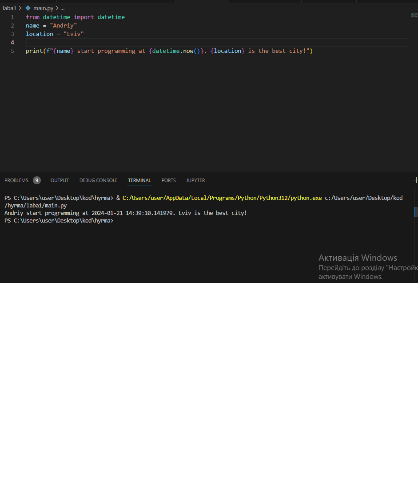

# Звіт до роботи №1
## Тема: Оформлення робіт та перша програма на Python.
### Мета роботи: Навчитись оформлювати роботи з допомогою форматування Markdown та написати першу програму на Python.

---
### Виконання роботи
- Результати виконання завдання:
    1. Створено файл з розширенням `.py` та напитсано першу програму яка знаходиться у файлі [main.py](main.py);
    1. Результат виконання програми на скріншоті: 
    1. Створили [Python Notebook](nb.ipynb) та додали пояснення до коду;
    1. Модифікували програму додавши використання бібліотеки `time` та запитались у ChatGPT як перевести час з Еpoch до нормального (зрозумілого людині);
    1. створили новий [Python Notebook](ai.ipynb) в якому всатвили відповідь від ChatGPT де він нам рекомендував першу програму.
        - в результаті прийшось правити програму самостійно, бо АІ не зміг її відлагодити.
    1. Навчились створювати та запускати програми на Python, працювати в Python Notebook, та за допомогою ChatGPT модифікували нашу першу програму.

- попрактикувались вставляти код та результат простим копіюванням, ось програма гнерерована ChatGPT:

  ```python
  # Програма для виведення привітання та введення імені користувача

  # Використовуємо функцію input() для отримання імені користувача
  ім'я = input("Введіть ваше ім'я: ")

  # Виводимо привітання разом із ім'ям користувача
  print("Привіт, " + ім'я + "!")
  ```

- програма вивела помилку:

```text
  Cell In[2], line 4
    ім'я = input("Введіть ваше ім'я: ")
                                     ^
SyntaxError: unterminated string literal (detected at line 4)
```

- як індивідуальни завадання, попрацювали з ChatGPT;

---
### Висновок: 
> у висновку потрібно відповісти на запитання:

- :white_check_mark: Що зроблено в роботі: виконали першу програму на Python, попрацювати у Python Notebook, задали запит ChatGPT та оформили звіт;
- :question: Чи досягнуто мети роботи: :+1:
- :question: Які нові знання отримано: навчились працювати з Python в інтерактивному режимі використовуючи Notebook :notebook: ;
- :question: Чи вдалось відповісти на всі питання задані в ході роботі: :white_check_mark:
- :question: Чи вдалося виконати всі завдання: :white_check_mark:
- :question: Чи виникли складності у виконанні завдання: :white_check_mark:

---